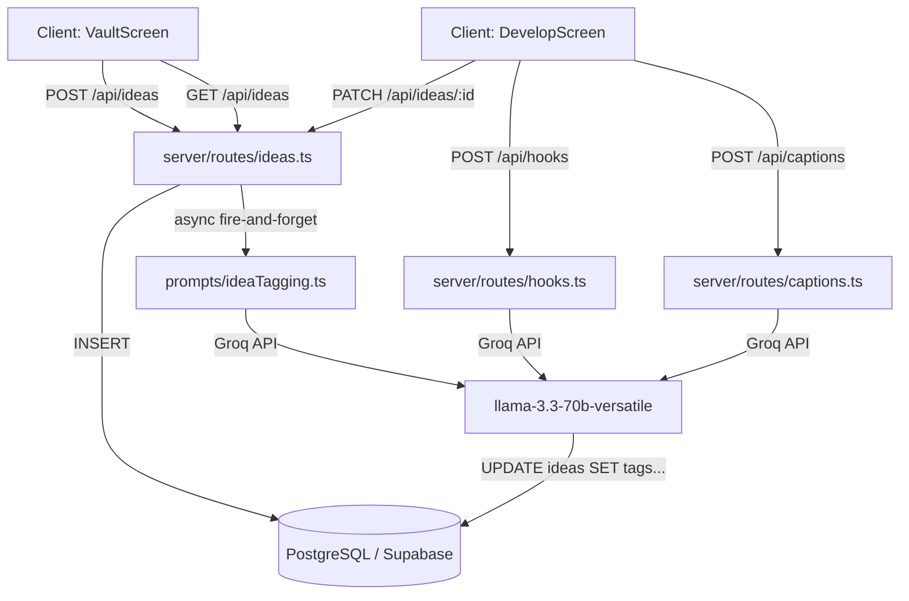
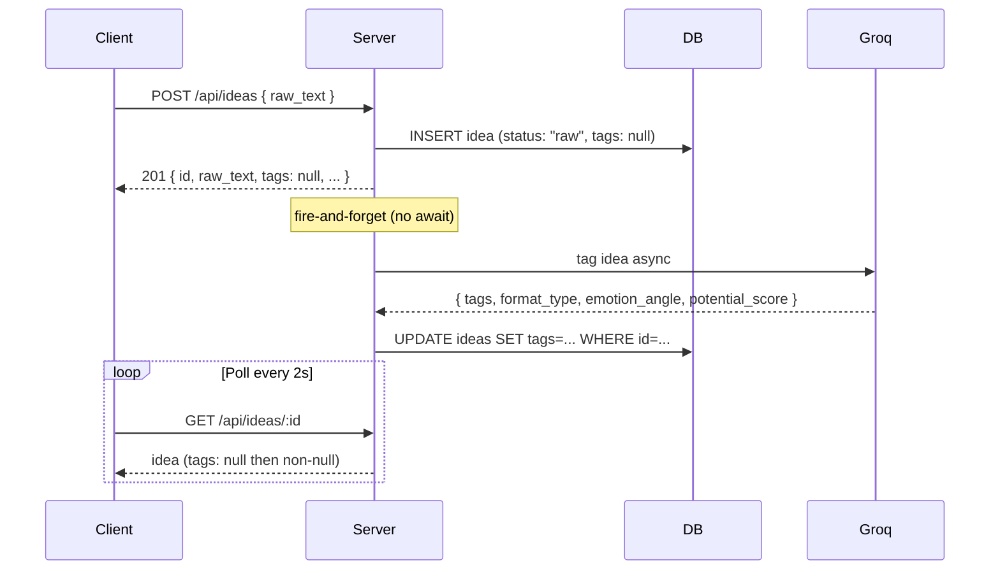

# Design Document: Idea Vault + Hook Engine

## Overview

This document describes the technical design for two new modules added to RepurposeAI.

**IdeaVault** is a persistent idea capture and management system backed by PostgreSQL (Supabase). Creators save raw ideas, which are immediately stored and then asynchronously tagged by the Groq AI. Ideas are browsable via a card grid with client-side filtering and sorting.

**Hook + Caption Engine (Develop screen)** is a multi-step content development workflow. A creator enters or loads a raw idea, generates five hook options, selects one, and receives four platform-native captions built around that hook. Captions support anchor keyword editing and feedback-based regeneration.

Both modules extend the existing React + Vite + TypeScript frontend and Node.js + Express + TypeScript backend without modifying any existing files.

---

## Architecture

### High-Level Flow



### Async Tagging Flow



### Module Boundaries

- `server/src/db/index.ts` — pg Pool singleton + `initDb()` that creates the `ideas` table on startup
- `server/src/routes/ideas.ts` — CRUD router, mounts at `/api/ideas`
- `server/src/routes/hooks.ts` — hook generation router, mounts at `/api/hooks`
- `server/src/routes/captions.ts` — caption generation router, mounts at `/api/captions`
- `server/src/prompts/ideaTagging.ts` — Groq prompt + response parser for async tagging
- `server/src/prompts/hooks.ts` — Groq prompt + response parser for hook generation
- `server/src/prompts/captionWithHook.ts` — Groq prompt for caption generation/regeneration

---

## Components and Interfaces

### Backend Routes

#### `POST /api/ideas`
- Validates `raw_text` present (400 if missing)
- Generates UUID v4 `id`, current `Date.now()` as `created_at`
- Inserts row with `status: "raw"`, `tags: null`, `hooks: null`, `captions: null`
- Responds immediately with the saved idea
- Fires async tagging (no `await`) — updates DB when complete

#### `GET /api/ideas`
- Accepts optional query params: `?score=`, `?format=`, `?status=`
- Builds WHERE clause dynamically from present params
- Returns array sorted by `created_at DESC`

#### `GET /api/ideas/:id`
- Returns single idea by id (used by frontend polling)
- 404 if not found

#### `PATCH /api/ideas/:id`
- Accepts partial Idea body
- Builds SET clause from present fields only
- Returns updated idea; 404 if not found

#### `DELETE /api/ideas/:id`
- Deletes row; returns 204; 404 if not found

#### `POST /api/hooks`
- Validates `raw_idea` present (400 if missing)
- Calls Groq with hook prompt
- Parses JSON array of 5 Hook objects
- Returns `Hook[]`

#### `POST /api/captions`
- Validates `hook`, `raw_idea`, `platform` present (400 if missing)
- Calls Groq with caption prompt (hook prepended verbatim as first line)
- Returns `{ content: string }`

#### `POST /api/captions/regenerate`
- Accepts `{ original_caption, feedback, platform, niche, anchor_keywords, language }`
- Empty `feedback` triggers full regeneration
- Returns `{ content: string }`

### Frontend Components

#### `CaptureBar`
- Auto-expanding textarea (max 3 lines before scroll)
- Microphone button using Web Speech API
- Clipboard paste button
- "Save idea" button + Enter key submit; Shift+Enter inserts newline
- Frosted glass style consistent with existing design

#### `IdeaCard`
- Displays raw text, tag chips, potential score dot, format type label
- Shimmer placeholders while `tags === null`
- "Develop →" button navigates to `/develop/:ideaId`
- "···" overflow menu: Mark as used, Edit, Delete
- Fade-out animation on delete

#### `HookCard`
- Hook text (16px) + trigger label (12px muted)
- "Use this hook →" button
- "↻ Try another" ghost button

#### `SettingsSlideOver`
- Niche input with autocomplete suggestions
- Sub-niche input
- Language dropdown
- Platform priority drag-to-reorder (HTML5 drag-and-drop, no external library)
- Persists to localStorage on close

#### `CaptureSlideOver`
- Fixed overlay, right side, 400px wide
- Wraps `CaptureBar` with auto-focus
- Closes after successful submit

### Frontend Hooks

#### `useSettings`
- Reads/writes `localStorage` key `"repurpose-ai-settings"`
- Default: `{ niche: "", sub_niche: "", language: "English", platform_priority: ["twitter","instagram","linkedin","reels"] }`

#### `useVault`
- Manages `ideas: Idea[]` state
- Exposes `addIdea`, `updateIdea`, `removeIdea`
- Handles polling every 2s for ideas with `tags === null`; stops after 30s or when tags arrive

#### `useDevelop`
- Manages hook generation state (`hooks: Hook[] | null`, `loading`, `error`)
- Manages caption generation state per platform
- Exposes `generateHooks`, `selectHook`, `generateCaption`, `regenerateCaption`

---

## Data Models

### PostgreSQL Schema

```sql
CREATE TABLE IF NOT EXISTS ideas (
  id              TEXT PRIMARY KEY,
  raw_text        TEXT NOT NULL,
  created_at      BIGINT NOT NULL,
  tags            JSONB,
  format_type     TEXT,
  emotion_angle   TEXT,
  potential_score TEXT,
  hooks           JSONB,
  captions        JSONB,
  status          TEXT NOT NULL DEFAULT 'raw'
);
```

### TypeScript Types (additions to `client/src/types/index.ts`)

```typescript
export interface Idea {
  id: string;
  raw_text: string;
  created_at: number;
  tags: string[] | null;
  format_type: string | null;
  emotion_angle: string | null;
  potential_score: "low" | "medium" | "high" | null;
  hooks: Hook[] | null;
  captions: Record<string, string> | null;
  status: "raw" | "developed" | "used";
}

export interface Hook {
  hook_text: string;
  trigger: string;
}

export interface CreatorSettings {
  niche: string;
  sub_niche: string;
  language: string;
  platform_priority: Platform[];
}
```

### AI Response Shapes

**Idea Tagging** (Groq returns JSON):
```json
{
  "tags": ["string"],
  "format_type": "string",
  "emotion_angle": "string",
  "potential_score": "low | medium | high"
}
```

**Hook Generation** (Groq returns JSON array):
```json
[{ "hook_text": "string", "trigger": "string" }]
```

**Caption Generation** (Groq returns plain text with hook as first line):
```
<hook verbatim>
<rest of platform-native caption>
```

### localStorage Schema

Key: `"repurpose-ai-settings"`
```json
{
  "niche": "",
  "sub_niche": "",
  "language": "English",
  "platform_priority": ["twitter", "instagram", "linkedin", "reels"]
}
```

---

## Correctness Properties

*A property is a characteristic or behavior that should hold true across all valid executions of a system — essentially, a formal statement about what the system should do. Properties serve as the bridge between human-readable specifications and machine-verifiable correctness guarantees.*

### Property 1: JSONB Round-Trip

*For any* valid Idea object with non-null `tags` (string array), `hooks` (Hook array), and `captions` (Record<string, string>), writing the idea to PostgreSQL and reading it back should produce a value deeply equal to the original for all three JSONB fields.

**Validates: Requirements 1.3, 18.1, 18.2, 18.3**

---

### Property 2: New Idea Invariants

*For any* non-empty `raw_text` string, calling `POST /api/ideas` should return an idea where `hooks` is null, `captions` is null, and `status` is `"raw"`.

**Validates: Requirements 1.4, 1.5, 2.1**

---

### Property 3: Async Tagging Does Not Block POST Response

*For any* `raw_text` input, the `POST /api/ideas` response should arrive before the Groq tagging call completes — the returned idea should have `tags: null` even when the tagging prompt is in-flight.

**Validates: Requirements 2.1, 2.2**

---

### Property 4: Ideas Sorted Descending by created_at

*For any* set of ideas in the database, `GET /api/ideas` should return them in an order where each idea's `created_at` is greater than or equal to the next idea's `created_at`.

**Validates: Requirements 2.3**

---

### Property 5: Filter Correctness

*For any* filter query (`?score=`, `?format=`, or `?status=`) and any set of ideas in the database, every idea returned by `GET /api/ideas` with that filter should have the corresponding field equal to the filter value, and no idea with a different value for that field should appear in the results.

**Validates: Requirements 2.4, 2.5, 2.6**

---

### Property 6: PATCH Updates Only Specified Fields

*For any* existing idea and any non-empty subset of its fields, calling `PATCH /api/ideas/:id` with only those fields should change exactly those fields and leave all other fields unchanged.

**Validates: Requirements 2.7**

---

### Property 7: Hook Array Invariants

*For any* valid `POST /api/hooks` request, the response array should contain exactly 5 Hook objects, and all 5 `trigger` values should be distinct strings drawn from the allowed trigger set (Curiosity Gap, Identity Threat, Controversy, Surprising Stat, Personal Story Angle, Pattern Interrupt).

**Validates: Requirements 3.1, 3.2**

---

### Property 8: Caption Always Starts With Selected Hook Verbatim

*For any* hook text and any platform, the caption returned by `POST /api/captions` should have the hook text as its exact first line (verbatim, no modification). The same invariant holds for `POST /api/captions/regenerate`.

**Validates: Requirements 4.2, 4.4**

---

### Property 9: Anchor Keywords Appear in Caption

*For any* non-empty list of `anchor_keywords` passed to `POST /api/captions`, each keyword string should appear at least once in the returned caption content.

**Validates: Requirements 4.3**

---

### Property 10: CaptureBar Enter Submits, Shift+Enter Inserts Newline

*For any* non-empty textarea value, pressing Enter (without Shift) should trigger idea submission. *For any* textarea value, pressing Shift+Enter should insert a newline character at the cursor position without triggering submission.

**Validates: Requirements 7.6, 7.7**

---

### Property 11: CaptureBar Rejects Empty Submission

*For any* string composed entirely of whitespace (including the empty string), attempting to submit via the CaptureBar should result in no API call being made and the textarea remaining unchanged.

**Validates: Requirements 7.9**

---

### Property 12: Settings Round-Trip via localStorage

*For any* `CreatorSettings` object, saving it via `useSettings` and then reading it back (simulating a fresh mount) should produce a value deeply equal to the original.

**Validates: Requirements 15.6, 15.7**

---

### Property 13: Settings Included in Hook and Caption Requests

*For any* settings state with non-empty `niche`, `sub_niche`, and `language`, every call to `POST /api/hooks` and `POST /api/captions` should include those values in the request body.

**Validates: Requirements 15.8**

---

### Property 14: AI Output Schema Validity

*For any* idea tagging response from Groq, the parsed object should have `tags` as a string array, `format_type` as a string, `emotion_angle` as a string, and `potential_score` as one of `"low" | "medium" | "high"`. *For any* hook generation response, the parsed array should contain objects each with `hook_text` (string) and `trigger` (string).

**Validates: Requirements 16.4, 16.5**

---

### Property 15: Banner Dismissal Persists for Session Only

*For any* browser session, once the Results screen banner is dismissed, `sessionStorage` should contain the dismissal flag and the banner should not re-render. After a new session (sessionStorage cleared), the banner should be visible again.

**Validates: Requirements 13.3**

---

### Property 16: Table Creation is Idempotent

*For any* database state, calling `initDb()` multiple times should always result in the `ideas` table existing and should never throw an error or corrupt existing data.

**Validates: Requirements 1.2**

---

### Property 17: NULL JSONB Fields Return null, Not Error

*For any* idea row where `tags`, `hooks`, or `captions` is NULL in the database, reading that idea via `GET /api/ideas/:id` should return `null` for those fields rather than throwing or returning undefined.

**Validates: Requirements 18.4**

---

## Error Handling

### Server

| Scenario | Response |
|---|---|
| `POST /api/ideas` missing `raw_text` | 400 `{ error: "raw_text is required" }` |
| `POST /api/hooks` missing `raw_idea` | 400 `{ error: "raw_idea is required" }` |
| `POST /api/captions` missing `hook`, `raw_idea`, or `platform` | 400 `{ error: "<field> is required" }` |
| `PATCH` or `DELETE` with unknown id | 404 `{ error: "Idea not found" }` |
| Groq API error during async tagging | Log error; leave `tags` as null (frontend polls until timeout) |
| Groq API error during hook/caption generation | 502 `{ error: "AI generation failed" }` |
| `DATABASE_URL` not set at startup | `console.error` + `process.exit(1)` |
| DB query error | 500 `{ error: "Internal server error" }` |

### Client

- **Polling timeout**: If `tags` remain null after 30 seconds (15 polls at 2s intervals), stop polling and display the card without metadata.
- **Hook generation failure**: Inline error state on the Develop screen with a retry button.
- **Caption generation failure**: Error state on the individual Caption_Card, matching the existing PlatformCard error style.
- **Settings parse failure**: If `localStorage` value is malformed JSON, fall back to defaults silently.
- **Vault load failure**: Full-page error state with a retry button.

---

## Testing Strategy

### Dual Testing Approach

Both unit tests and property-based tests are required and complementary:
- **Unit tests** cover specific examples, integration points, and error conditions
- **Property-based tests** verify universal invariants across randomized inputs

### Property-Based Testing Library

**Backend and Frontend**: [`fast-check`](https://github.com/dubzzz/fast-check) — TypeScript-native, works with Vitest.

Each property test must run a minimum of **100 iterations**.

Tag format for each test:
```
// Feature: idea-vault-and-hook-engine, Property N: <property_text>
```

### Property Test Mapping

| Property | Test File | fast-check Arbitraries |
|---|---|---|
| P1: JSONB Round-Trip | `server/src/db/index.test.ts` | `fc.array(fc.string())`, `fc.record(...)` |
| P2: New Idea Invariants | `server/src/routes/ideas.test.ts` | `fc.string({ minLength: 1 })` |
| P3: Async Tagging Non-Blocking | `server/src/routes/ideas.test.ts` | `fc.string({ minLength: 1 })` |
| P4: Sort Descending | `server/src/routes/ideas.test.ts` | `fc.array(fc.record({ created_at: fc.integer() }))` |
| P5: Filter Correctness | `server/src/routes/ideas.test.ts` | `fc.constantFrom("low","medium","high")` |
| P6: PATCH Partial Update | `server/src/routes/ideas.test.ts` | `fc.record(...)` with partial keys |
| P7: Hook Array Invariants | `server/src/routes/hooks.test.ts` | `fc.string({ minLength: 1 })` |
| P8: Caption Starts With Hook | `server/src/routes/captions.test.ts` | `fc.string({ minLength: 1 })` |
| P9: Keywords in Caption | `server/src/routes/captions.test.ts` | `fc.array(fc.string({ minLength: 1 }))` |
| P10: CaptureBar Keyboard | `client/src/components/CaptureBar.test.tsx` | `fc.string({ minLength: 1 })` |
| P11: CaptureBar Empty Rejection | `client/src/components/CaptureBar.test.tsx` | `fc.string().filter(s => s.trim() === "")` |
| P12: Settings Round-Trip | `client/src/hooks/useSettings.test.ts` | `fc.record({ niche: fc.string(), ... })` |
| P13: Settings in Requests | `client/src/hooks/useDevelop.test.ts` | `fc.record(...)` |
| P14: AI Output Schema | `server/src/prompts/ideaTagging.test.ts` | `fc.string({ minLength: 1 })` |
| P15: Banner Session Dismissal | `client/src/screens/ResultsScreen.test.tsx` | `fc.boolean()` |
| P16: Table Init Idempotent | `server/src/db/index.test.ts` | N/A (example-based) |
| P17: NULL Fields Return null | `server/src/routes/ideas.test.ts` | `fc.constantFrom(null, undefined)` |

### Unit Test Coverage

Unit tests should cover:
- `POST /api/ideas` returns 400 on missing `raw_text`
- `POST /api/hooks` returns 400 on missing `raw_idea`
- `POST /api/captions` returns 400 on missing required fields
- `PATCH`/`DELETE` return 404 on unknown id
- `DATABASE_URL` missing causes process exit on startup
- Navbar renders Vault and Develop links
- Develop screen pre-loads idea text from route state
- Save to Vault calls POST then PATCH for fresh ideas (not from Vault)
- Settings slide-over autocomplete suggestions render correctly
