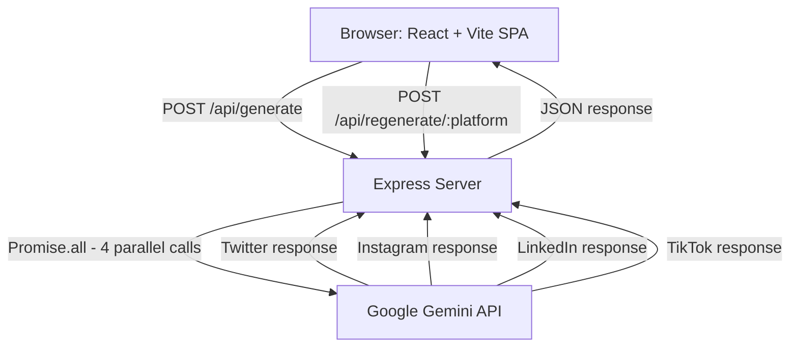
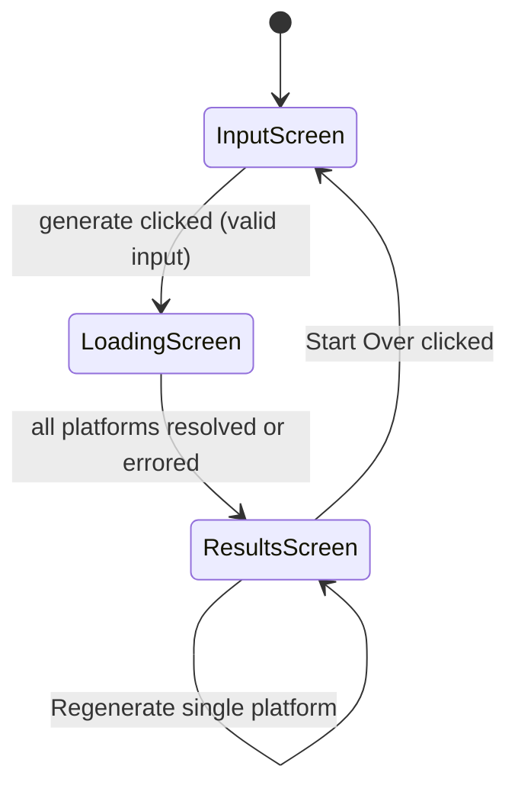

# Design Document

## Overview

RepurposeAI is a stateless, single-session web app that transforms raw long-form content (YouTube transcripts or blog posts) into four platform-native social media posts simultaneously. The user pastes content, clicks generate, and receives fully formatted outputs for Twitter/X, LinkedIn, Instagram, and TikTok — all in parallel, with no login, no database, and no configuration.

The architecture is a thin React + Vite frontend communicating with a Node.js + Express backend. The backend acts as a secure proxy to the Google Gemini API, keeping the API key server-side. All state is ephemeral and lives in React component state for the duration of the browser session.

---

## Architecture



### Screen Flow



### Key Design Decisions

- **No streaming**: All four platform results are returned in a single JSON response after `Promise.all` resolves. Individual card shimmer states are driven by per-platform promise resolution tracked in React state.
- **No auth / no DB**: Session state only. The backend is stateless between requests.
- **API key security**: The Gemini API key is stored in a `.env` file on the server and never exposed to the client.
- **Parallel generation**: All four Gemini calls are dispatched simultaneously via `Promise.all` on the backend. Per-platform errors are caught individually so one failure does not block the others.

---

## Components and Interfaces

### Frontend Components

```
src/
  App.tsx                  # Root component, owns screen state
  screens/
    InputScreen.tsx        # Textarea, character counter, sample chips, generate button
    LoadingScreen.tsx      # Four PlatformCards in shimmer state
    ResultsScreen.tsx      # Four PlatformCards with content, Start Over button
  components/
    PlatformCard.tsx       # Renders one platform's output (shimmer | content | error)
    CharacterCounter.tsx   # Live word + character count display
    SampleChip.tsx         # Clickable chip that pre-fills textarea
    CopyButton.tsx         # Copy-to-clipboard with 1500ms "Copied" feedback
    RegenerateButton.tsx   # Triggers single-platform regeneration
  hooks/
    useGenerate.ts         # Orchestrates parallel generation, manages per-platform state
    useClipboard.ts        # Clipboard write + timed label reset
  api/
    generate.ts            # POST /api/generate client call
    regenerate.ts          # POST /api/regenerate/:platform client call
  types/
    index.ts               # Shared TypeScript types
```

### Backend Structure

```
server/
  index.ts                 # Express app entry point
  routes/
    generate.ts            # POST /api/generate handler
    regenerate.ts          # POST /api/regenerate/:platform handler
  services/
    generator.ts           # Gemini API calls, prompt construction
  prompts/
    base.ts                # Shared base instruction set
    twitter.ts             # Twitter-specific system prompt
    instagram.ts           # Instagram-specific system prompt
    linkedin.ts            # LinkedIn-specific system prompt
    tiktok.ts              # TikTok-specific system prompt
```

### API Interface

**POST /api/generate**
```typescript
// Request
{ rawContent: string }

// Response
{
  twitter:   { content: string } | { error: string },
  instagram: { content: string } | { error: string },
  linkedin:  { content: string } | { error: string },
  tiktok:    { content: string } | { error: string }
}
```

**POST /api/regenerate/:platform**
```typescript
// Request
{ rawContent: string }
// :platform = "twitter" | "instagram" | "linkedin" | "tiktok"

// Response
{ content: string } | { error: string }
```

---

## Data Models

### TypeScript Types

```typescript
export type Platform = "twitter" | "instagram" | "linkedin" | "tiktok";

export type CardState =
  | { status: "idle" }
  | { status: "loading" }
  | { status: "success"; content: string }
  | { status: "error"; message: string };

export type GenerationState = Record<Platform, CardState>;

export interface GenerateRequest {
  rawContent: string;
}

export interface GenerateResponse {
  twitter:   { content: string } | { error: string };
  instagram: { content: string } | { error: string };
  linkedin:  { content: string } | { error: string };
  tiktok:    { content: string } | { error: string };
}

export interface RegenerateResponse {
  content?: string;
  error?: string;
}
```

### App Screen State

```typescript
type Screen = "input" | "loading" | "results";

// App.tsx state shape
interface AppState {
  screen: Screen;
  rawContent: string;
  generation: GenerationState;
}
```

### Prompt Construction

Each platform prompt is composed of two layers:

1. **Base instructions** (shared): Extract specific, non-obvious ideas; write in creator's voice; avoid filler phrases and corporate language.
2. **Platform instructions** (per-platform): Format rules, tone, length constraints, structural requirements.

```typescript
// generator.ts
function buildPrompt(platform: Platform, rawContent: string): string {
  return `${BASE_INSTRUCTIONS}\n\n${PLATFORM_PROMPTS[platform]}\n\nContent:\n${rawContent}`;
}
```

### Validation Rules

| Rule | Value |
|------|-------|
| Minimum word count | 100 words |
| Twitter tweet count | Exactly 3 tweets |
| Twitter tweet length | ≤ 280 characters each |
| Instagram hashtags | 5–15 hashtags |
| LinkedIn word count | 150–250 words |
| TikTok sections | HOOK, POINT 1, POINT 2, POINT 3, CTA (in order) |


---

## Correctness Properties

*A property is a characteristic or behavior that should hold true across all valid executions of a system — essentially, a formal statement about what the system should do. Properties serve as the bridge between human-readable specifications and machine-verifiable correctness guarantees.*

### Property 1: Character counter accuracy

*For any* string typed into the textarea, the Character_Counter SHALL display a word count equal to the number of whitespace-delimited tokens in that string and a character count equal to the string's length.

**Validates: Requirements 1.3, 2.4**

---

### Property 2: Sample chip replaces textarea content

*For any* Sample_Chip and any prior textarea content, clicking the chip SHALL result in the textarea containing exactly the chip's predefined sample text and nothing else.

**Validates: Requirements 1.5**

---

### Property 3: Generate button enabled iff word count >= 100

*For any* string in the textarea, the generate button SHALL be enabled if and only if the word count of that string is greater than or equal to 100. Equivalently, for any string with fewer than 100 words the button SHALL be disabled, and for any string with 100 or more words the button SHALL be enabled.

**Validates: Requirements 2.2, 2.3**

---

### Property 4: Short input shows validation message

*For any* string with fewer than 100 words, attempting to submit it SHALL display an inline validation message and SHALL NOT navigate away from the Input_Screen.

**Validates: Requirements 2.1**

---

### Property 5: Per-platform card state transitions independently

*For any* platform whose generation request resolves (success or error), only that platform's Platform_Card SHALL change state; the other three cards SHALL remain in their prior state.

**Validates: Requirements 3.3, 4.2, 7.3, 7.5**

---

### Property 6: Platform error shows error state with retry

*For any* platform whose generation or regeneration request returns an error, that platform's Platform_Card SHALL display an error state containing a retry option.

**Validates: Requirements 3.4, 7.4**

---

### Property 7: Shimmer cards display platform name and icon

*For any* Platform_Card in shimmer/loading state, the card SHALL display the platform's name and icon.

**Validates: Requirements 4.3**

---

### Property 8: Start Over resets all state

*For any* app state on the Results_Screen, clicking the Start_Over_Button SHALL transition the app to the Input_Screen and SHALL clear all generated content from all four Platform_Cards.

**Validates: Requirements 5.2, 5.3**

---

### Property 9: Copy button writes exact content to clipboard

*For any* Platform_Card in success state, clicking the Copy_Button SHALL write the full, unmodified content string of that card to the system clipboard.

**Validates: Requirements 6.2**

---

### Property 10: Copy button label resets after 1500ms

*For any* Copy_Button click, the button label SHALL change to "Copied" immediately and SHALL revert to its original label after exactly 1500 milliseconds.

**Validates: Requirements 6.3**

---

### Property 11: Regenerate puts only that card in shimmer

*For any* platform's Regenerate_Button click, only that platform's Platform_Card SHALL enter shimmer/loading state; the other three cards SHALL remain in their current content or error state.

**Validates: Requirements 7.2**

---

### Property 12: Twitter output has exactly 3 tweets

*For any* valid Raw_Content input, the Generator SHALL produce a Twitter_Post containing exactly 3 tweets.

**Validates: Requirements 8.1**

---

### Property 13: Each tweet fits within 280 characters

*For any* valid Raw_Content input, every tweet in the generated Twitter_Post SHALL have a character count less than or equal to 280.

**Validates: Requirements 8.4**

---

### Property 14: Instagram post has required structural sections

*For any* valid Raw_Content input, the generated Instagram_Post SHALL contain a hook line, a body section, and a hashtag cluster.

**Validates: Requirements 9.1**

---

### Property 15: Instagram hook fits before truncation point

*For any* valid Raw_Content input, the hook line of the generated Instagram_Post SHALL be 125 characters or fewer.

**Validates: Requirements 9.2**

---

### Property 16: Instagram hashtag count is in range

*For any* valid Raw_Content input, the number of hashtags in the generated Instagram_Post SHALL be between 5 and 15 inclusive.

**Validates: Requirements 9.3**

---

### Property 17: LinkedIn post word count is in range

*For any* valid Raw_Content input, the word count of the generated LinkedIn_Post SHALL be between 150 and 250 inclusive.

**Validates: Requirements 10.1**

---

### Property 18: LinkedIn post ends with a question

*For any* valid Raw_Content input, the generated LinkedIn_Post SHALL end with a sentence that is a question (i.e., the final non-whitespace character is "?"), and the post SHALL contain multiple paragraphs.

**Validates: Requirements 10.2, 10.4**

---

### Property 19: TikTok script contains all required labeled sections in order

*For any* valid Raw_Content input, the generated TikTok_Script SHALL contain the labels HOOK, POINT 1, POINT 2, POINT 3, and CTA appearing in that order.

**Validates: Requirements 11.1**

---

### Property 20: TikTok HOOK section is brief enough for 3-second delivery

*For any* valid Raw_Content input, the HOOK section of the generated TikTok_Script SHALL contain 15 words or fewer (approximately 3 seconds of spoken delivery at average pace).

**Validates: Requirements 11.2**

---

### Property 21: All platform prompts include the base instruction set

*For any* platform, the prompt string constructed by the Generator SHALL contain the full text of the shared base instruction set in addition to the platform-specific instructions.

**Validates: Requirements 12.3**

---

## Error Handling

### Input Validation Errors

- Word count < 100: inline message below textarea, generate button remains disabled, no navigation.
- Empty textarea: generate button disabled, no message until first submit attempt.

### API Errors

- Per-platform Gemini API error: that card transitions to error state with a "Retry" button. Other cards are unaffected.
- Network timeout or 5xx from Express: same per-platform error state.
- All four platforms fail: Results_Screen still renders with four error cards.
- Regeneration failure: only the regenerating card shows error state; other cards retain their content.

### Server-Side Errors

- Missing or invalid `rawContent` in request body: Express returns `400 Bad Request` with a descriptive message.
- Missing `GEMINI_API_KEY` environment variable: server fails to start with a clear error log.
- Gemini API rate limit (429): Express returns the error to the client; the affected card shows error state.

---

## Testing Strategy

### Dual Testing Approach

Both unit tests and property-based tests are required. They are complementary:

- **Unit tests** cover specific examples, integration points, and edge cases.
- **Property-based tests** verify universal correctness across all valid inputs.

### Unit Tests (specific examples and integration)

- Input validation: empty string, exactly 99 words, exactly 100 words, 101 words.
- Sample chip click replaces textarea content.
- Copy button label resets after 1500ms (using fake timers).
- Start Over clears state and returns to InputScreen.
- All four platform prompts are distinct strings.
- Base instruction text is present in all four constructed prompts.
- Express `POST /api/generate` returns 400 for missing body.
- Express `POST /api/regenerate/:platform` returns 400 for unknown platform.
- Results_Screen renders when all four platforms have resolved.
- Error card renders retry button.

### Property-Based Tests

Property-based testing library: **fast-check** (TypeScript/JavaScript).

Each property test runs a minimum of **100 iterations**.

Each test is tagged with a comment in the format:
`// Feature: repurpose-ai, Property N: <property_text>`

| Property | Test Description |
|----------|-----------------|
| P1 | For any string, counter displays correct word and character counts |
| P2 | For any chip and any prior content, chip click sets textarea to chip text |
| P3 | For any string, button enabled iff word count >= 100 |
| P4 | For any string < 100 words, submit shows validation message, stays on InputScreen |
| P5 | For any platform resolution, only that card changes state |
| P6 | For any platform error, that card shows error state with retry |
| P7 | For any platform in shimmer state, card shows name and icon |
| P8 | For any results state, Start Over resets to InputScreen with cleared content |
| P9 | For any platform content, Copy_Button writes exact content to clipboard |
| P10 | For any Copy_Button click, label is "Copied" then reverts after 1500ms |
| P11 | For any platform regeneration, only that card enters shimmer |
| P12 | For any valid input, Twitter output has exactly 3 tweets |
| P13 | For any valid input, every tweet is <= 280 characters |
| P14 | For any valid input, Instagram output has hook, body, hashtags |
| P15 | For any valid input, Instagram hook is <= 125 characters |
| P16 | For any valid input, Instagram hashtag count is in [5, 15] |
| P17 | For any valid input, LinkedIn word count is in [150, 250] |
| P18 | For any valid input, LinkedIn ends with a question and has multiple paragraphs |
| P19 | For any valid input, TikTok has all 5 labeled sections in order |
| P20 | For any valid input, TikTok HOOK is <= 15 words |
| P21 | For any platform, constructed prompt contains base instruction text |

### Test Configuration

```typescript
// fast-check configuration
fc.configureGlobal({ numRuns: 100 });
```

### Generators

- `fc.string({ minLength: 1 })` — arbitrary strings for counter and validation tests
- `fc.array(fc.string(), { minLength: 100, maxLength: 500 }).map(words => words.join(' '))` — valid raw content (>= 100 words)
- `fc.constantFrom('twitter', 'instagram', 'linkedin', 'tiktok')` — platform selector
- `fc.record({ content: fc.string() })` — mock successful platform response
